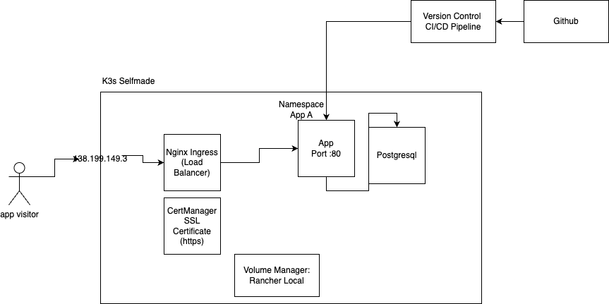

# Cloud Provider Comparison:



https://www.serverhunter.com/

# Kubernetes Kubectl Management CLI Tool:

K9s https://k9scli.io/

# Hetzner Referral Code:

https://hetzner.cloud/?ref=Oq4OYhgNBCWp

# generating a ssh key

`ssh-keygen -f ~/.ssh/dftutorial`

# installing k3s

curl -sfL https://get.k3s.io | K3S_TOKEN=asd252345aGFEas sh -s - server --cluster-init --disable traefik

sudo cat /etc/rancher/k3s/k3s.yaml
-> copy the content of the file to your local .kube/config

### installing helm

```bash
curl -fsSL -o get_helm.sh https://raw.githubusercontent.com/helm/helm/main/scripts/get-helm-3
chmod 700 get_helm.sh
./get_helm.sh
```

### installing nginx-ingress & cert-manager

```bash
helm repo add ingress-nginx https://kubernetes.github.io/ingress-nginx
helm repo add jetstack https://charts.jetstack.io
helm repo update

helm install ingress-nginx ingress-nginx/ingress-nginx -n kube-system
helm install cert-manager jetstack/cert-manager --namespace kube-system --set crds.enabled=true
kubectl apply -f clusterissuer.yaml


```

# installing clusterissuer (onetime)

kubectl apply -f kubernetes-selfmade/clusterissuer.yaml

-> Point an A and AAAA record \*.k8s.yourdomain.com to the server ip

# installing the sample app

kubectl apply -f kubernetes-selfmade/nginx-deploymetn.yaml
